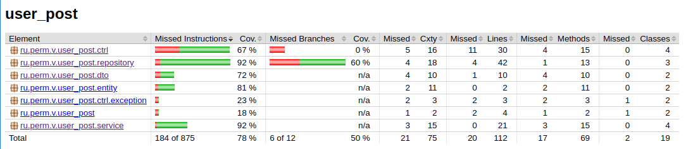

## Простой проект на Kotlin User-Post

Это maven проект.

Для тестов использован [Mockito](https://site.mockito.org/)

### Запуск тестов

```shell
./mvnw test
```

### Отчет о покрытии тестами

````shell
./mvnw verify
````

Отчет будет сгенерирован в target/site/jacoco/index.html



### Запуск приложения

````shell
./mvnw spring-boot:run
````

### Ручное тестирование

````shell

$ http http://127.0.0.1:8080/posts/1
HTTP/1.1 200
Connection: keep-alive
Content-Type: application/json
Date: Thu, 04 May 2023 16:41:58 GMT
Keep-Alive: timeout=60
Transfer-Encoding: chunked

{
  "author": {
  "email": "EMAIL_1",
  "id": 1,
  "name": "NAME_1"
  },
  "content": "CONTENT_1",
  "id": 1,
  "title": "TITLE_1"
}
````


### Примечания

Конвертация в DTO сделана в сервисах, т.к. этот слой ближе к БД или другим подобным внешним системам. Можно ее сделать в контроллерах, но их логика может предполагать разные условия или даже совсем другие внешние DTO. Из внутренних DTO можно конвертировать во внешние. Цель отвязаться от entity базы данных.  